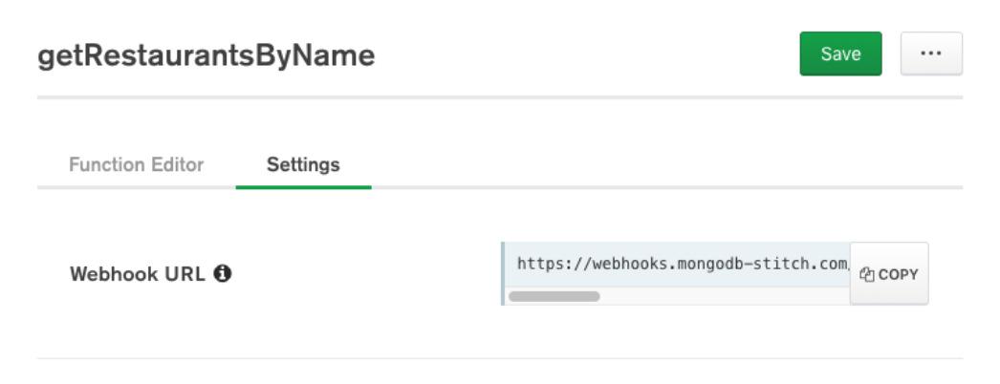
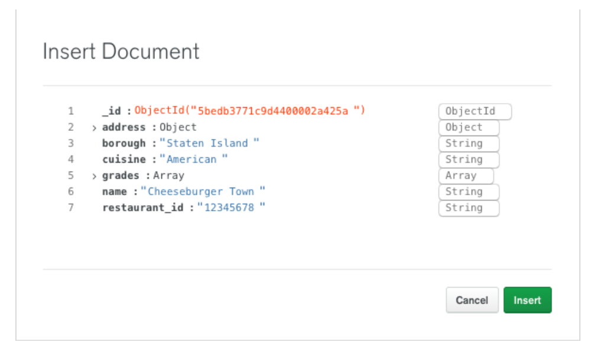

# birmingham-workshop
Repository includes files/instructions useful in the MongoDB Workshop for Birmingham, AL - 2019.01.10

# Welcome to Brewing Up Innovation with MongoDB
# Jan. 10, 2019

## Introduction to MongoDB Atlas and MongoDB Stitch
### Hands-on Workshop

### Overview
This hands-on workshop is designed to get you familiar with all aspects of MongoDB, from deploying a cluster, to loading data to creating services to access that data. 

### Prerequisites
To successfully complete this workshop:

You must be able to make outgoing requests from your computer to MongoDB Atlas servers which will be running on port 27017. Please confirm that port 27017 is not blocked by clicking http://portquiz.net:27017. If successful, you will see a page load that indicates you can make outgoing requests on port 27017.
Privileges to install software on your computer. We will be installing [MongoDB Compass](https://www.mongodb.com/download-center/compass) in this workshop.

### Hands-on Labs
#### Lab 1 - Create the Cluster
#### Create an Account or Log In to Atlas
We’ll be using [MongoDB Atlas](https://www.mongodb.com/cloud/atlas), our fully managed MongoDB-as-a-service, for this workshop. Go to https://cloud.mongodb.com and either create a new account or log into an existing account you may have previously created.
#### Create a Free Tier Cluster
#### Click Build a Cluster:


Take a moment to browse the options (Provider & Region, Cluster Tier, Version, Backup, …). For our workshop, select AWS as the Cloud Provider:


and set the Cluster Name to Workshop: (or anything you like)


The remaining defaults will suffice.

Click Create Cluster:


Continue to Lab 2 while the cluster is provisioning. 

#### Lab 2 - Connect to the Cluster
#### Install Compass
Compass is the GUI for MongoDB. Go to https://www.mongodb.com/download-center/compass to download and install Compass for your platform. 

#### Setup Connection Security
Return to the Atlas UI. Your cluster should now be provisioned. Click the CONNECT button, which will prompt you to set up connection security:


Add Your Current IP Address and Create a MongoDB User.  This example assumes a Username 'workshop' and password 'workshop'.


Click Choose a connection method and select Connect with MongoDB Compass.

Then select I am using Compass 1.12 or later and COPY the connection string presented:


#### Connect Compass
Start Compass and it should detect the connection string in your copy buffer:


Select Yes.

Provide the password (workshop) and before clicking CONNECT, CREATE a FAVORITE named Workshop. This will allow us to quickly connect to the cluster in the future.

Click CONNECT.

If successful, you’ll see some internal databases used by MongoDB:


#### Lab 3 - Load Data
Lab 3 - Load Data
For this workshop we’re going to load a Yelp like collection of New York City restaurants. Download the dataset from Github. If you have the wget utility, you can get the dataset as follows:

````
wget https://raw.githubusercontent.com/mongodb/docs-assets/primer-dataset/primer-dataset.json
````

Otherwise, just open the link in your browser and once the load completes, save the file (File > Save Page As in Chrome).

Or, it is also included as part of this GitHub repo in the data directory as primer-dataset.json.

The dataset is 11.9 MB and has 25K restaurants.

#### Create a Database and Collection
Click the CREATE DATABASE button and create a Workshop database with a Restaurants collection:


Navigate to the Restaurants collection and select Import Data from the menu. Then BROWSE to the primer-dataset.json file you downloaded:


Then select IMPORT.


#### Lab 4 - Browse the Documents
Notice how the restaurant documents have a nested subdocument (address) and an array of subdocuments (grades). In a relational database, these fields would most likely be separate tables, but MongoDB allows us to embed this information. Working with data in this natural way is much easier than decomposing and composing from relational tables.

#### Lab 5 - View the Schema
Wait, I thought MongoDB was a NoSQL database, and hence, didn’t have a schema? While that’s technically true, no dataset would be of any use without a schema. So while MongoDB doesn’t enforce a schema, your collections of documents will still always have one. The key difference with MongoDB is that the schema can be flexible.

Select the Schema tab and select Analyze Schema. Compass will sample the documents in the collection to derive a schema. In addition to providing field names and types, Compass will also provide a summary of the data values. For example, for cuisine, we can see that Chinese is the 2nd most common at 12%:


Expand the address field to discover MongoDB's excellent support for [Geospatial Queries](https://docs.mongodb.com/manual/geospatial-queries/).

#### Lab 6 - Query the Data
Unsurprisingly, the MongoDB Query Language (MQL) is also based on JSON. The Schama Analyzer in Compass provides an easy way to learn the language. For example, select Staten Island from the borough field (only Sta may be showing) and Chinese from the cuisine field. Notice as you make selections the FILTER field at the top of the window gets populated:


Click the ANALYZE  button to filter for Chinese restaurants in Staten Island, of which there a 88:


And you can now see this reflected on our map (more dots now appear on Staten Island because our sample now includes all 88 restaurants)


To perform a geospatial query, shift click and drag a circle on the map. Once the circle is in place, it can be moved and resized:


And notice the $geoWithin filter that got added to our query:


Finally, click   ANALYZE  again and click the Documents tab to view the Chinese restaurants in our selected radius in Staten Island:


#### Lab 7 - Create a Microservice
Next we’ll create a microservice that we’ll expose to our application teams as a REST API. We’ll accomplish this via a MongoDB Stitch Function and HTTP Service. Our microservice will allow us to query for restaurants by name.
Create the Stitch Application
Stitch is a serverless platform, where functions written in JavaScript automatically scale to meet current demand. Click Stitch Apps on the menu on the left and then click the Create New Application button.

Name the application Workshop. The other defaults are fine:


Click Create, which will take you to the Welcome to Stitch! page.

#### Create the Function
Now we’ll create the function that queries restaurants by name. Click Functions on the left and then Create New Function. Name the function getRestaurantsByName:


Click Save, which will open the Function Editor. 

Replace the example code in the editor with the following:
````
exports = function(arg) {

  console.log("getRestaurantsByName function called.");

  var collection = context.services
    .get("mongodb-atlas").db("Workshop").collection("Restaurants");
    
  var doc = collection.findOne({name: arg});
  
  return doc;
};
````
In the Console below the editor, change the argument from ‘Hello world’ to ’Chef Hong’:


Then click Run to test the function:


#### Expose the Function as a REST service
Click the Services menu on the left and then Add a Service. You’ll notice Stitch supports service integrations with Twilio, AWS and GitHub, making it very easy for you to leverage these providers’ unique capabilities. More genetically, Stitch also provides an HTTP Service, which we will use to expose our function as a REST API.

Select the HTTP service and name it restaurants:


Click Add Service. You’ll then be directed to Add an Incoming Webhook. Do so and configure the settings as shown below (the Webhook Name is getRestaurantsByName):


To keep things simple for this introduction we’re running the webhook as the System user and we’re skipping validation. Click Save, which will take us to the function editor for the service.

In the service function we will capture the query argument and forward that along to our newly created function. Note, I could have skipped creating the function and just coded the service functionality here, but the function allows for better reuse, such as calling it directly from a client application via the SDK. Replace the code with the following:
````
exports = function(payload) {

  var queryArg = payload.query.arg || '';
  return context.functions.execute("getRestaurantsByName", queryArg);

};
````

Then set the arg in the Console to ‘Chef Hong’:


and click Run to verify the result:


Use the API
The beauty of a REST API is that it can be called from just about anywhere. For the purposes of this workshop, we’re simply going to execute it in our browser. However, if you have tools like Postman installed, feel free to try that as well.

Switch back to the Settings tab of the getRestaurantsByName service and you’ll notice a Webhook URL has been generated. 


Click the COPY button and paste the URL into your browser. There’s actually a restaurant in the dataset with no name, so you’ll get a result. However, append the following to the end of your URL:

...service/restaurants/incoming_webhook/getRestaurantsByName?arg=Chef%20Hong
and submit again:


#### Create a Trigger
Stitch Triggers provide a easy way enable event processing in your applications. For example, for our restaurants collection:
We could send a text via Twilio to a restaurant owner when they receive a new review. 
We could email registered users, using AWS Simple Email Service (SES), when a new restaurant in their neighborhood opens up.

To keep things simple, whenever a new restaurant is added to the collection, we’ll also add that restaurant to a health inspector collection for review.

Click the Triggers menu on the left and Add a Database Trigger. Supply the information as show below:


Then link a New Function named triggerHealthInspection and replace the example code with the following:

````
exports = function(changeEvent) {
  
    var fullDocument = changeEvent.fullDocument;
    var collection = context.services.get("mongodb-atlas")
      .db("Workshop").collection("NewRestaurants");
    var status = collection.insertOne(fullDocument);
    console.log(status);
    
};
````


And Save the trigger.  


To test the trigger, let’s use the data explorer in Atlas. Navigate back to your cluster and select the Collections tab. Hover over a document in the Restaurants collection and click the clone icon document icon that appears in the upper right.


Optionally change some of the fields:


And click Insert.

Refresh the Collections page to see your NewRestaurants collection:


